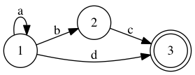

###About

My take one simple [Finite State Machine](https://en.wikipedia.org/wiki/Finite-state_machine), which is a simple automaton like the one sketched below:

Its purpose is straightforward: Determine whether a given string will is formed according to the grammar of the machine outline.
For example in the picture`aaabc` is valid but `aaabbc` is not.

**conventions**
The initial state is encoded as a transition with only a start value.
### ToDo

 - Read intial state from transitions :white_check_mark:
 - Read final states from transitions

